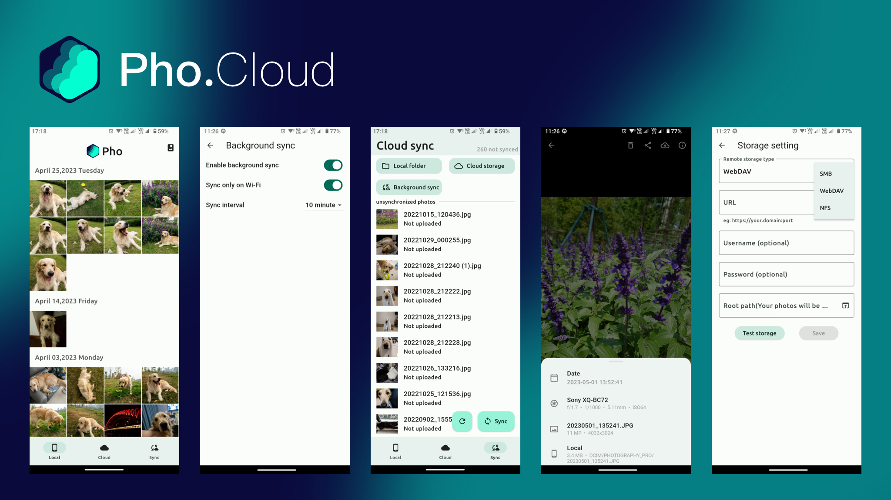

<br/><br/><p align="center">

</p>
<h3 align="center">
Pho - 一个用于查看和上传照片的无服务端应用
</h3>
<p align="center">
  
</p>
<p align="center">
  <a href="README.md">中文</a> | <a href="README_EN.md">English</a>
</p>

### 安装
[下载apk](https://github.com/fregie/pho/releases) 

[Google Play](https://play.google.com/store/apps/details?id=com.fregie.pho)  

[App store](https://apps.apple.com/cn/app/pho-%E5%90%8C%E6%AD%A5%E7%85%A7%E7%89%87%E5%88%B0nas-%E7%BD%91%E7%9B%98/id6451428709)

> 注: Google Play和App store的版本包含专业版功能,专业版功能未开源.

### 介绍
该应用的目的是替代手机上的自带相册应用,并且能够将照片同步到网络储存.  
功能简单,只是用于查看照片以及同步照片到网络储存.试图做到优秀的体验.

### 功能
* 本地照片查看
* 云端照片查看
* 增量同步照片到云端
* 后台定期同步
* 无数据库,无服务端
* 以时间组织云端存储的目录结构

### 支持的网络储存
- [x] Samba
- [x] Webdav
- [x] NFS
- [x] 百度网盘
- [ ] 阿里网盘
- [ ] oneDrive
- [ ] google drive
- [ ] google photo

### Screenshots
<p align="left">

</p>

### roadmap
- [x] 支持放大/缩小图片
- [x] 支持上传/浏览视频
- [x] 支持NFS
- [x] 支持百度网盘
- [x] 支持IOS端
- [ ] 支持desktop端
- [x] 支持中文

### Contribute
感谢各位的积极反馈

给本项目提需求的还不少,但是我一个人精力有限,如果你有兴趣,欢迎加入.

可以在issue中回复沟通,帮忙一起做一些功能,提出你的pull request.

### 文件储存逻辑
本着尽可能简单的逻辑来储存文件,以时间为目录结构,以文件名为文件名储存源文件.在根目录创建一个`.thumbnail`目录来储存生成的缩略图,缩略图的目录结构与源文件相同.  
你可以随时以其他形式利用你备份上去的照片,而不用依赖此app.
目录结构示意图:
```bash
├── 2022
│   ├── 07
│   │   ├── 02
│   │   │   ├── 20220702_100940.JPG
│   │   │   ├── 20220702_111416.JPG
│   │   │   └── 20220702_111508.JPG
│   │   └── 03
│   │       ├── 20220703_101923.DNG
│   │       ├── 20220703_112336.DNG
│   │       └── 20220703_112338.DNG
├── 2023
│   └── 01
│       └── 03
│           ├── 20230103_112348.JPG
│           ├── 20230103_124634.JPG
│           └── 20230103_124918.DNG
└── .thumbnail
     └── 2022
         └── 07
             ├── 02
             │   ├── 20220702_100940.JPG
             │   ├── 20220702_111416.JPG
             │   └── 20220702_111508.JPG
             └── 03
                 ├── 20220703_101923.DNG
                 ├── 20220703_112336.DNG
                 └── 20220703_112338.DNG
```


### Star History

[](https://star-history.com/#fregie/pho&Date)
