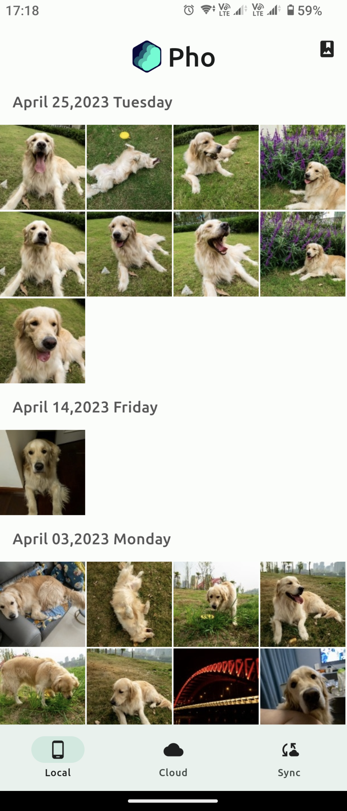
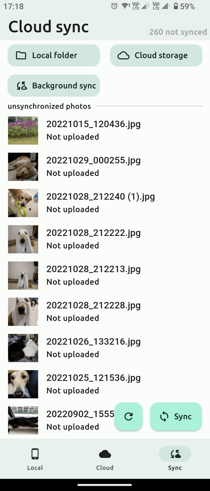

  

<h3 align="center">
Pho - 一个用于查看和上传照片的无服务端应用
</h3>

  

  <a href="README.md">中文</a> | <a href="README_EN.md">English</a>

### 安装
目前仅支持安卓端.  
[点我下载apk](https://github.com/fregie/pho/releases)

### 介绍
功能简单,只是用于查看照片以及同步照片到网络储存.试图做到优秀的体验.

### 功能
* 本地照片查看
* 云端照片查看
* 增量同步照片到云端
* 后台定期同步
* 无数据库,无服务端
* 以时间组织云端存储的目录结构

### 支持的网络储存
- [x] Samba
- [x] Webdav
- [x] NFS
- [ ] 阿里网盘

### Screenshots

### roadmap
- [x] 支持放大/缩小图片
- [ ] 支持上传/浏览视频
- [x] 支持NFS
- [ ] 支持阿里网盘
- [ ] 支持IOS端
- [ ] 支持web端